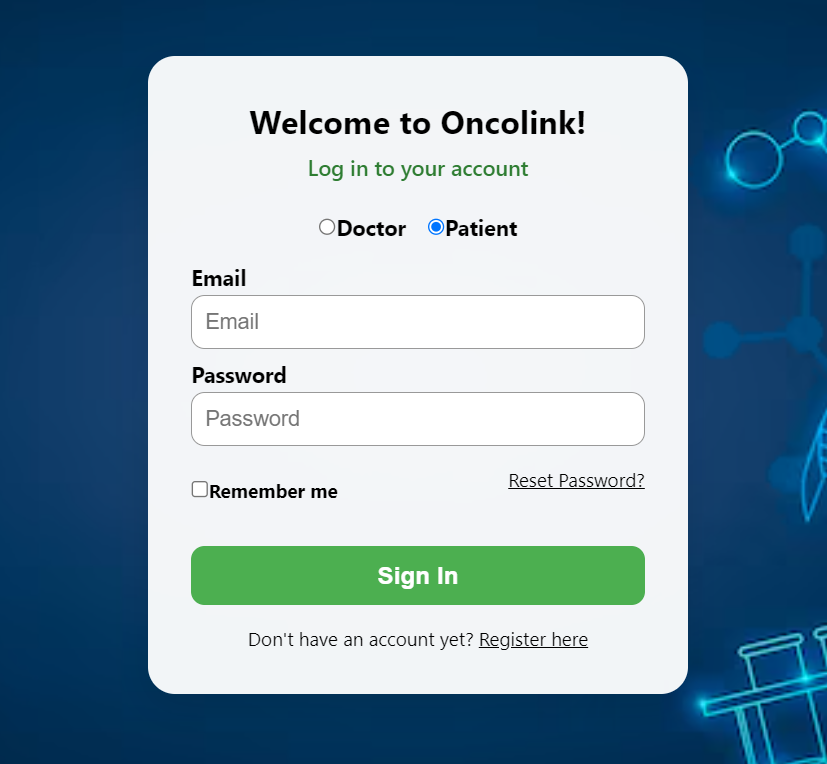

# OncoLink - Comprehensive Oncology Support Platform

## Overview
OncoLink is a comprehensive platform designed to support cancer patients and healthcare providers with tools for meal planning, AI-powered diagnostics, and secure communication. The communications module is available as a separate component: [OncoLink Communications](https://github.com/your-username/oncolink-communications).

## Features

### 1. AI-Powered Chemotherapy Efficacy Predictor
Our advanced machine learning model predicts the efficacy of platinum-based chemotherapy drugs, helping oncologists make more informed treatment decisions.
<!-- Placeholder for prediction interface screenshot -->
<div align="center">
  <h3>Chemotherapy Efficacy Predictor</h3>
  
  <p><em>AI-powered tool for predicting platinum-based chemotherapy drug efficacy</em></p>
</div>

### 2. Intelligent 7-Day Meal Planner
Our advanced meal planning system generates a complete 7-day meal plan with breakfast, lunch, and dinner options, specifically designed for cancer patients' nutritional needs.

Key Features:
- Utilizes the **Knapsack Algorithm** to optimize meal nutrition within dietary constraints
- Implements **N-Queens Algorithm** to ensure meal variety and prevent repetition
- Includes **Extra Meals** section with alternative options for easy substitutions
- Customized based on treatment stage and dietary restrictions

<!-- Meal Planner Screenshots -->
<div align="center">
  <h3>7-Day Meal Planning Interface</h3>
  
  
  <p><em>Personalized weekly meal planning with intelligent algorithms for optimal nutrition</em></p>
</div>

### 3. User-Friendly Landing Page
An intuitive entry point to all platform features.
<!-- Login Page -->
<div align="center">
  <h3>Login Page</h3>
  
  <p><em>Secure login interface for patients and healthcare providers</em></p>
</div>

### 4. Secure Communications Portal
Secure messaging system for patients and healthcare providers.
<!-- Additional Model Information -->
<div align="center">
  <h3>Alternative Models Explored</h3>
  
  <p><em>Exploration of alternative machine learning approaches for treatment prediction</em></p>
</div>

## Communication Module
The communications module is a separate component that enables secure messaging between patients and healthcare providers. For the latest version and documentation, please visit:

[OncoLink Communications Repository](https://github.com/your-username/oncolink-communications)

## Getting Started

### Prerequisites
- Node.js (v14 or higher)
- Python 3.7+
- npm or yarn

### Installation
1. Clone the repository:
   ```bash
   git clone https://github.com/AnjKal/Onco_Link.git
   cd Onco_Link
   ```

2. Install dependencies:
   ```bash
   npm install
   ```

3. Start the development server:
   ```bash
   npm start
   ```

## Contributing
Contributions are welcome! Please read our contributing guidelines before submitting pull requests.

## License
This project is licensed under the MIT License - see the [LICENSE](LICENSE) file for details.
